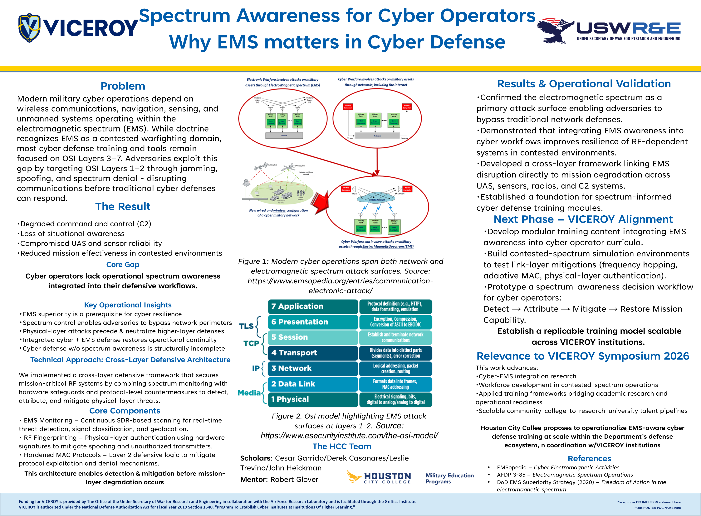

# Projects & Labs

---

## Spectrum Awareness for Cyber Operators: Why EMS Matters in Cyber Defense (VICEROY Poster)

This project was developed and presented as a National VICEROY Symposium Poster Finalist. It focuses on how adversaries exploit the electromagnetic spectrum (EMS) to disrupt cyber operations through jamming and spoofing attacks at OSI Layers 1–2.

### Key Contributions:
- Designed a Detect → Attribute → Mitigate workflow for spectrum-aware cyber defense  
- Analyzed how RF-layer attacks can bypass traditional cybersecurity tools  
- Applied Software Defined Radio (SDR) concepts for threat detection and signal analysis  

[View Full Poster](assets/GarridoC_HoustonCityCollege_2026.pdf)
