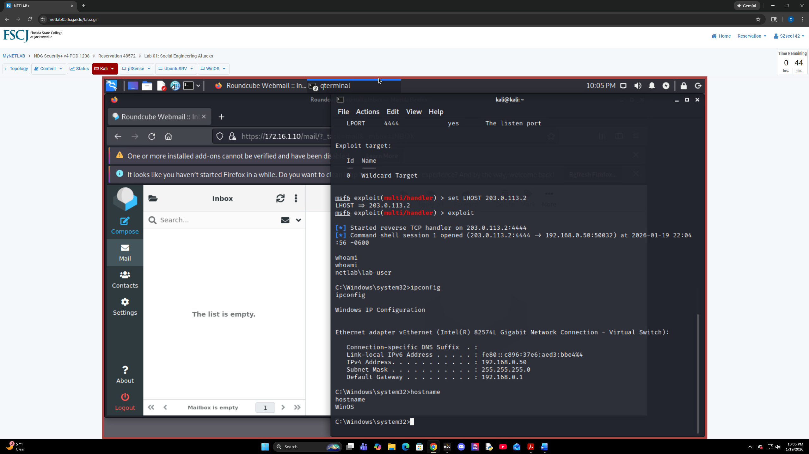

# Projects & Labs

---

## Spectrum Awareness for Cyber Operators: Why EMS Matters in Cyber Defense (VICEROY Poster)

This project was developed and presented as a National VICEROY Symposium Poster Finalist. It focuses on how adversaries exploit the electromagnetic spectrum (EMS) to disrupt cyber operations through jamming and spoofing attacks at OSI Layers 1–2.

### Key Contributions:
- Designed a Detect → Attribute → Mitigate workflow for spectrum-aware cyber defense  
- Analyzed how RF-layer attacks can bypass traditional cybersecurity tools  
- Applied Software Defined Radio (SDR) concepts for threat detection and signal analysis  

[View Full Poster](assets/GarridoC_HoustonCityCollege_2026.pdf)

# NDG Guided Labs

---

## NDG Security+ Lab: Social Engineering Attack

### Overview
This guided lab focused on understanding how social engineering attacks can be used to compromise systems in a controlled cybersecurity lab environment. The exercise demonstrated phishing concepts, payload delivery, reverse shell communication, and post-compromise verification techniques.

### Tools & Technologies
- Kali Linux
- Metasploit Framework
- msfvenom
- Windows OS
- pfSense Firewall
- Ubuntu Server
- Virtual Machines

### Key Tasks Performed
- Generated a simulated payload using msfvenom
- Configured a reverse TCP handler through Metasploit
- Crafted a phishing-style email within the lab environment
- Established a reverse shell session to the target machine
- Verified user access, hostname, and internal IP configuration

### What I Learned
This lab improved my understanding of social engineering techniques, phishing risks, reverse shell concepts, and the importance of layered defensive security controls. I also gained hands-on experience using Linux command-line tools and the Metasploit Framework within a controlled environment.

### Lab Evidence

### Supporting Documentation
[View NDG Lab Instructions](assets/NDG_SecPlusv4_Lab_01.pdf)

---

# CyberOps Projects

---

## Build Your Mini SOC (Sysmon + Splunk)

### Overview
This hands-on cybersecurity project focused on building a small Security Operations Center (SOC) environment using Sysmon and Splunk. The objective was to configure endpoint logging, forward Sysmon events into Splunk, and analyze security-related activity through centralized log monitoring.

### Tools & Technologies
- Splunk
- Sysmon
- Windows Event Viewer
- PowerShell
- Windows 11
- Log Analysis
- SIEM Concepts

### Key Tasks Performed
- Downloaded and configured Sysmon on a Windows system
- Installed Sysmon using a custom configuration file
- Verified Sysmon event generation in Event Viewer
- Configured Splunk inputs.conf to ingest Sysmon logs
- Generated PowerShell activity to create security events
- Queried and analyzed logs inside Splunk
- Investigated command execution activity using search queries

### Skills Developed
- SIEM Monitoring
- Log Analysis
- Event Correlation
- Endpoint Visibility
- PowerShell Monitoring
- Threat Detection Fundamentals

### What I Learned
This project improved my understanding of how Security Operations Centers monitor endpoint activity and investigate suspicious behavior through centralized logging. I learned how Sysmon enhances Windows logging visibility and how Splunk can be used to search, filter, and analyze security events in real time. The project also demonstrated how even basic PowerShell activity can be tracked and reviewed during investigations.

### Supporting Documentation & Lab Evidence
[View Mini SOC Project Documentation](assets/Project1_Mini_SOC_Fillable-2_Garrido_Cesar.docx)

---

# XP Cyber Challenges

---

## Experience Cyber – Secure Domain Accounts & Passwords

### Overview
This XP Cyber challenge focused on implementing and verifying secure password and account lockout policies within a Windows domain environment. The objective was to configure Group Policy Objects (GPOs) to enforce organizational security requirements and strengthen account security controls.

### Tools & Technologies
- Windows Server
- Active Directory
- Group Policy Objects (GPO)
- Domain Administration
- Windows Security Policies

### Key Tasks Performed
- Created and linked domain-level Group Policy Objects (GPOs)
- Configured account lockout thresholds and durations
- Implemented password complexity requirements
- Configured password history and minimum password length policies
- Applied password age and encryption settings
- Verified policy enforcement through challenge validation checks

### Skills Developed
- Active Directory Administration
- Windows Domain Security
- Group Policy Management
- System Hardening
- Security Policy Enforcement
- Account Security Configuration

### What I Learned
This challenge improved my understanding of how organizations enforce secure authentication policies within enterprise Windows environments. I gained hands-on experience configuring domain security settings and learned how password policies, account lockouts, and Group Policy Objects help reduce the risk of unauthorized access and credential-based attacks.

### Supporting Documentation & Challenge Results
[View XP Cyber Challenge Report](assets/GarridoCesar_NCPReport153386.pdf)

---
